# Portfolio
---
## Web

### Shoe website v2.0 using nodejs and boostrap
My web is about storing and managing products ,orders... of shoes ,this is a significant for both the back end and front end of the older web

**Key components:** 
- **Authentication using Jwt :**  I used jwt to generate the key containing the staff's login infomation, and set an expriation time for the token ,as the result,even when the staff closed the tab ,the token remains valid.
- **Authorization:** Initially , i intended to use AuthorizeApi after each API route to verify the role's permission. However ,the primary reason for handling it through view filtering is to prevent roles without the necessary permissions from even being aware of the existence of certain functionalities.
- **Orders Management:** With the appropriate permission ,the staff can update the status of orders.An order can be canceled at anytime,as long as its status is not in certain specific states . The customer of the order is also allowed to cancel it too.
- **User infomation handling:** Manage users' data such as addresses, orders, and personal details.

**Techonologies used:** 

- **Front-End :**  Boostrap,HTML,CSS,Pug,Javascript.
- **Back-End:** Nodejs (framework express),JWT, Restful Api
- **Database:** MongoDB
## demo
**Home Page**

    
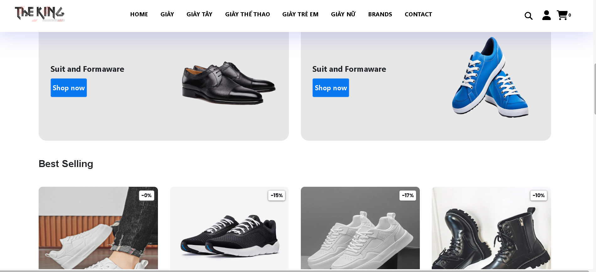

**Products Page**

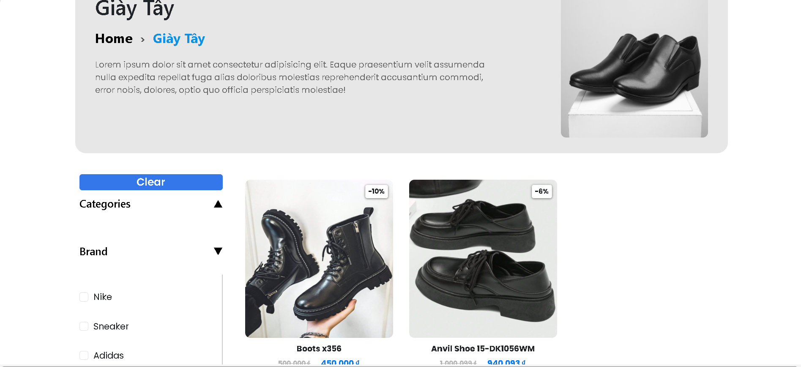

**Products Detail**

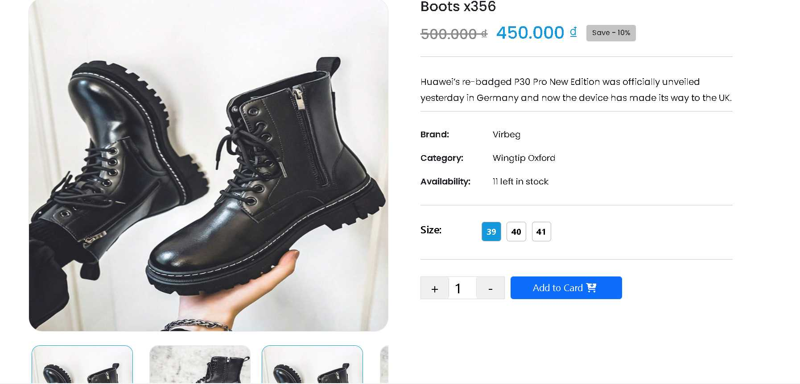

**Cart Page**

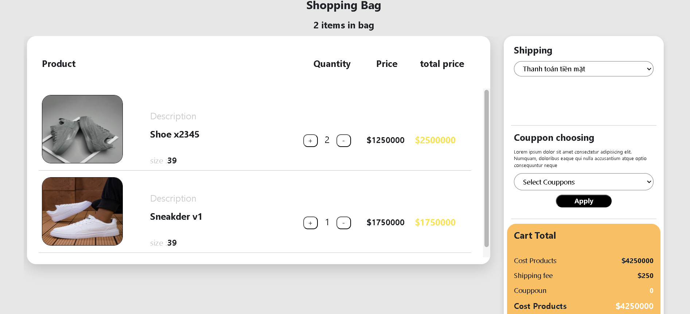

**User infomation page**

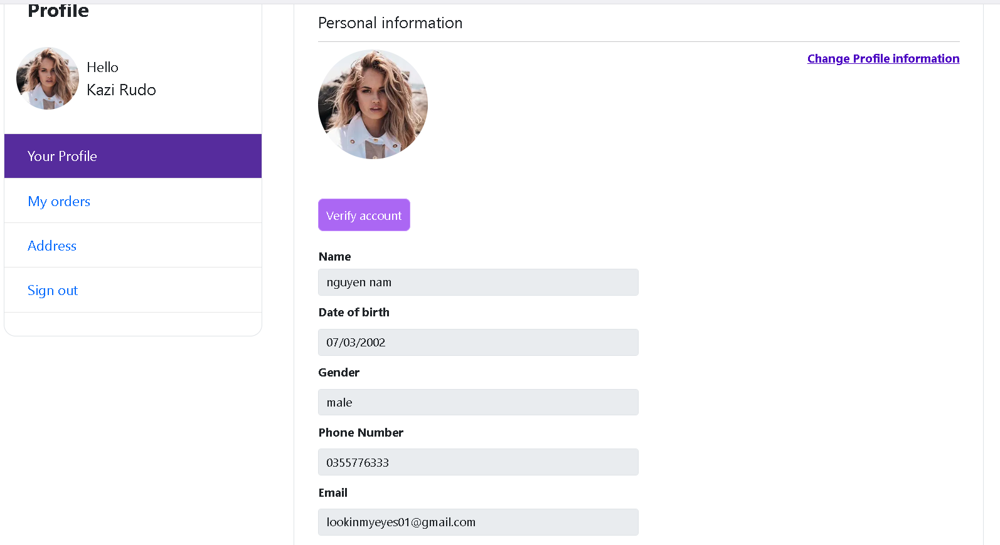

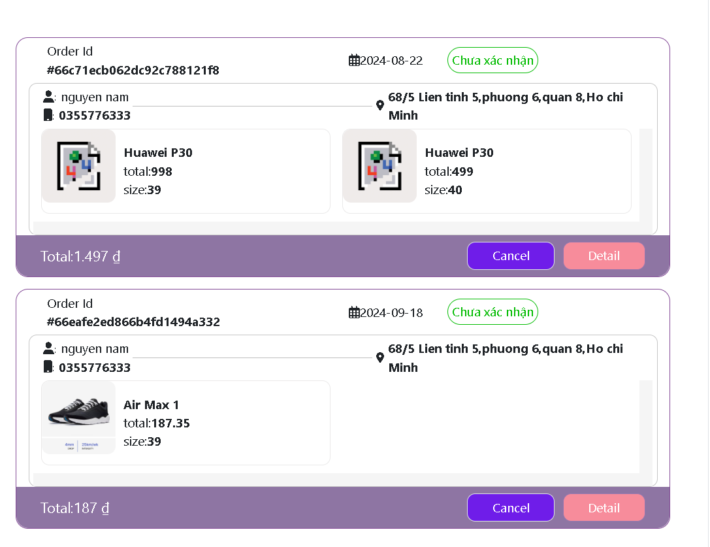

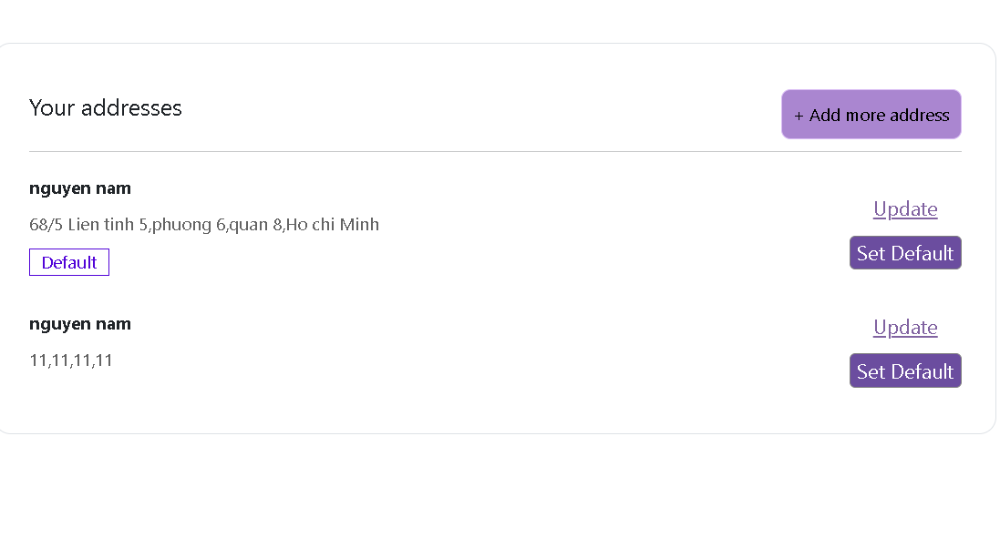

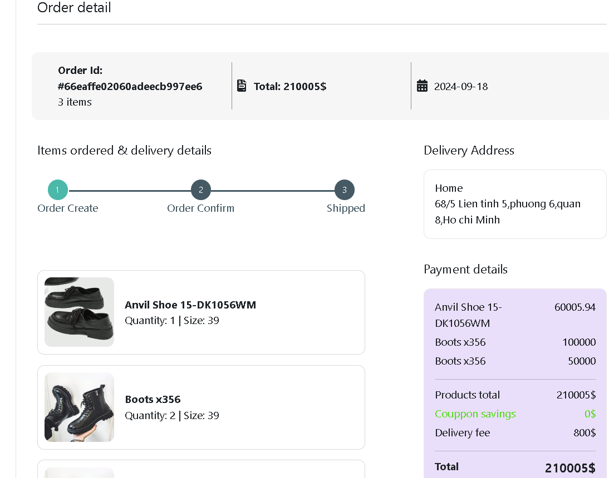

**Admin page**

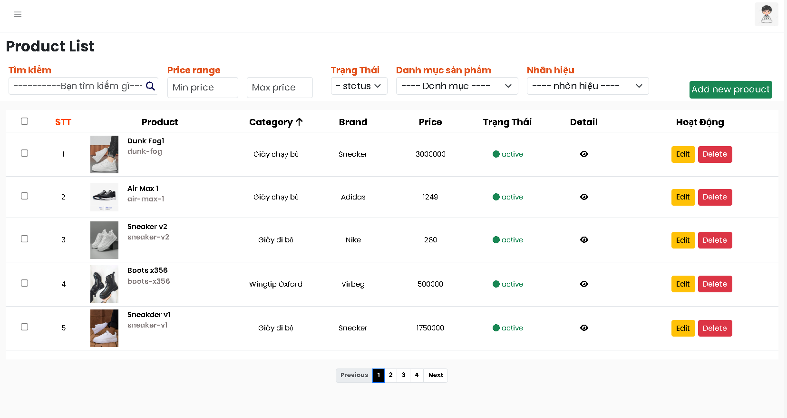

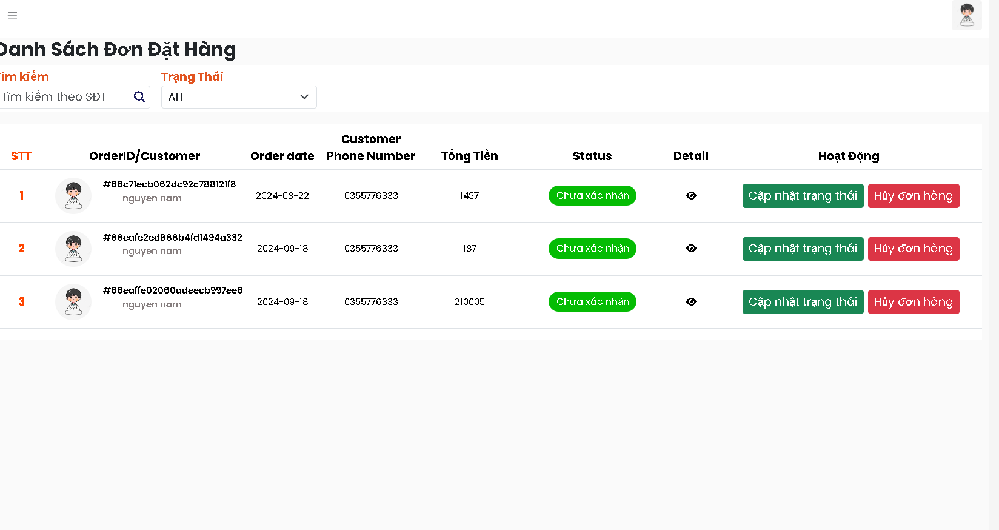

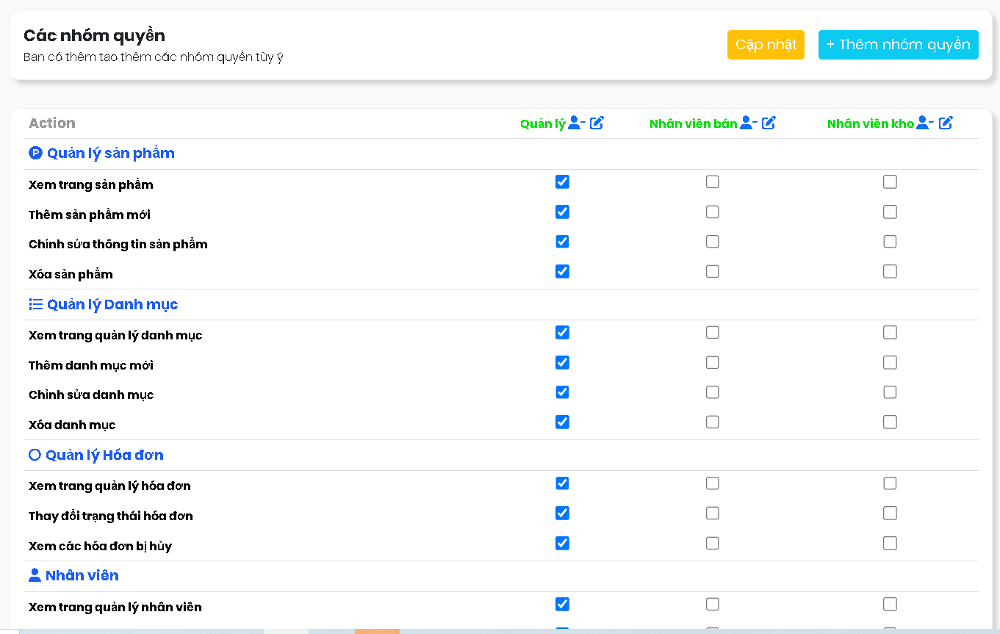

 

## ONLINE SHOES SHOPPING SYSTEM 

### Introduction

Developed a comprehensive e-commerce platform for online shoe shopping, enhancing the customer experience with a
responsive front-end and robust back-end. Increased user engagement by improving site responsiveness and streamlining the checkout
process in a fast-paced development environment. This system has three modules: Admin, Employee, and Client.

- **Admin:** 
  - Can perform CRUD operations on products.
  - Add new employees.
  - Grant permissions for employees to view/edit/create.

- **Employee:** 
  - Manage orders and product information.

- **Client:**
  - Users can sign up/sign in (via external provider: Google or regular login by authenticating account via Gmail).
  - Shop and store products in the shopping cart even if the website is turned off.
  - View purchase history.

### Technologies Used
- **Front-End:** JavaScript, AJAX, JQuery, Bootstrap 5, HTML, CSS
- **Back-End:** PHP, SQL
- **Database:** MySQL Workbench, PhpmyAdmin
- **Third-Party Integration:**  Twilio SMS, PHPMailer, OAuth 2.0 (Implemented Twilio SMS for customer notifications, PHPMailer for seamless email communication, and OAuth 2.0 for secure user authentication, boosting customer satisfaction by 20%.)
### Demo

    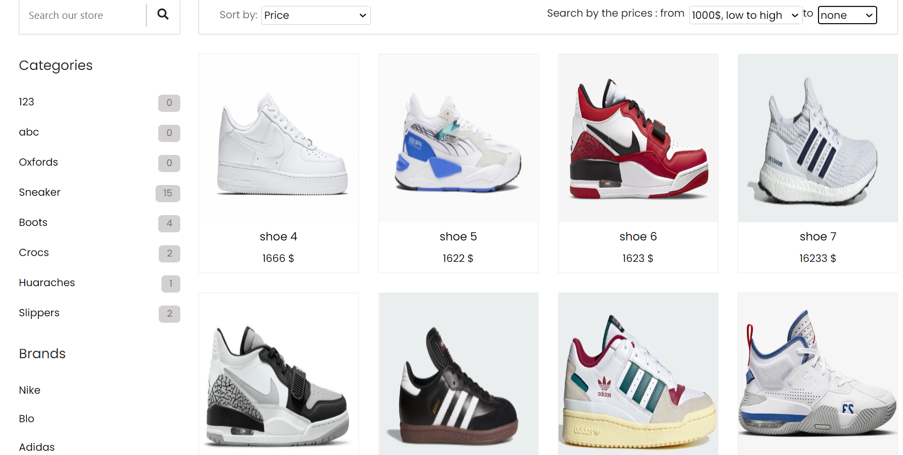

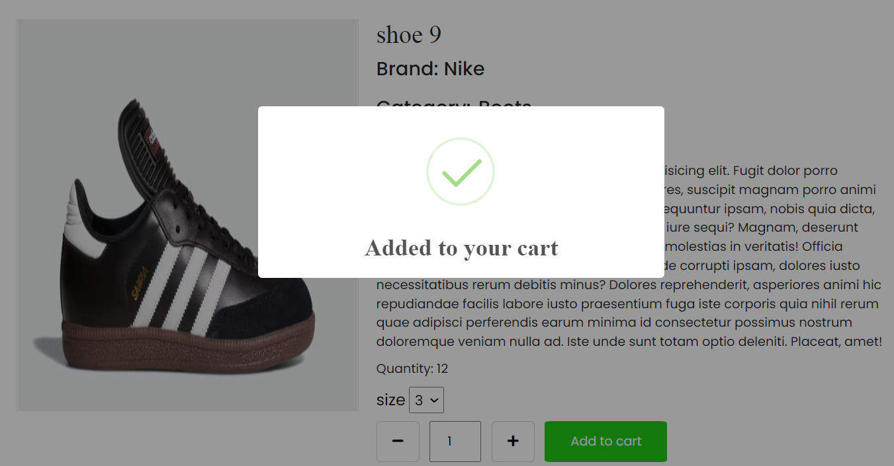

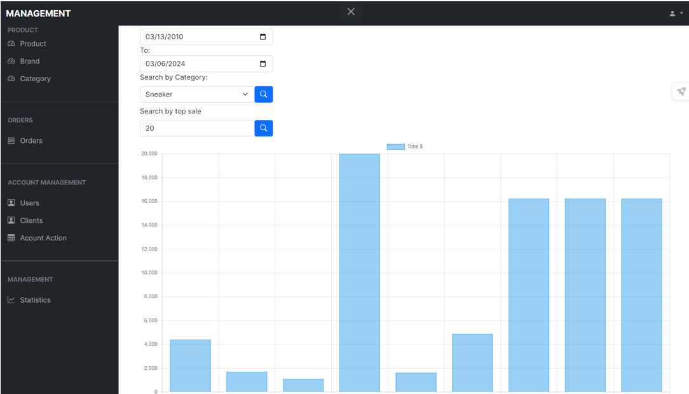

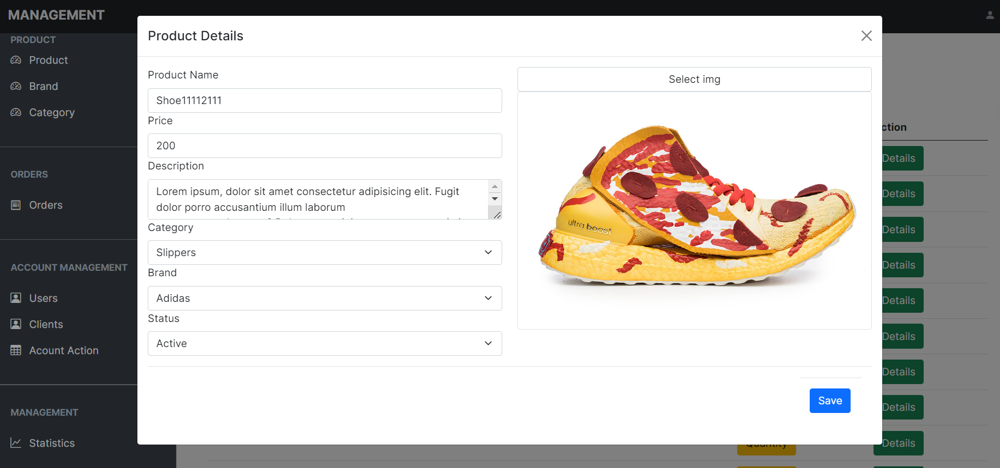

